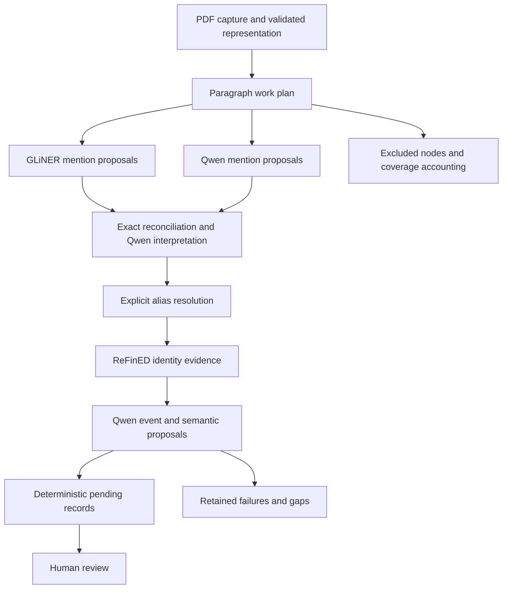

# KoteKomi: ingestion architecture review
**Completed source review — 4 September 2026**

Reviewed commit: **65d00c7a7cb7be22e1b033d6ae1aeb935428cf04**. Scope: deposited PDF through pending, human-reviewable Intelligence Ledger candidates, assessed for eventual wiki and briefing usefulness on a 24 GB M5 MacBook.

## 1. Assessment

**Keep the hybrid architecture. Its allocation of authority is sound, and the code implements much of it carefully. The highest-value work is to improve semantic coverage and execution reliability before undertaking model fine-tuning.**

GLiNER and Qwen independently propose mentions; Qwen interprets them; ReFinED supplies advisory external identity candidates; deterministic functions preserve source coordinates, construct typed records, and enforce admission prerequisites; humans approve or reject proposed intelligence. ReFinED is not the semantic authority, and Qwen does not author accepted Ledger records. These are appropriate boundaries. [Production orchestration][C1], [proposal construction][C12].

However, “proves exactly which text they interpreted” needs a precise scope. The engine can demonstrate the archived request and the source characters to which an output was aligned. It cannot prove the model understood those characters correctly, that OCR recovered the PDF correctly, or that a statement is true. It also cannot establish that every intended input token reached the model when runtime tokenization and context limits are not verified.

The key findings, in priority order:

| Priority | Finding | Evidence and consequence |
|---|---|---|
| P1 — runtime correctness | Context accounting uses whitespace counts and checks the manifest before appending task-local input. | A local probe sent a 2,039-count request through a profile limited to 512; the fake runtime was called and extraction succeeded. This is an admission-check defect, independent of actual Qwen tokenization. |
| P1 — recovery correctness | ReFinED's timeout covers waiting for initial readable output, not completion of a response; a timeout leaves the worker channel reusable. | Local probes exceeded the configured deadline after a partial line and returned request A's late response to request B. Alignment validation limits downstream damage, but the channel needs reset and request correlation. |
| P1 — intelligence coverage | The production extraction plan selects paragraphs, and governed semantics currently offer seven event frames. | Tables/list items are excluded from this plan; ordinary facts and many news event types cannot become equivalent governed candidates through this path. “Paragraph complete” is not “all useful intelligence extracted.” |
| P1 — semantic accuracy | Separate Qwen support judgments can repeat the original semantic error. | The HP-7 evaluation admitted a false recommendation to review despite all support checks passing. A human rejected it. |
| P2 — occurrence accuracy | Mention interpretation is reused by segment ID plus exact text, without occurrence offsets. | Repeated words in one segment can have different contextual kinds or discourse roles. This requires an occurrence-sensitive regression case. |
| P2 — recoverable work | Reuse is centered on terminal paragraph receipts, including accounted gaps. | Re-ingestion successfully avoids all calls, but it also reuses failed/gapped work; interrupted paragraphs lack equivalent task-level continuation in this path. |
| P2 — input contracts | Qwen output is strict bounded text parsed after generation; no decoder schema is sent by the active adapter. | Malformed output is contained, but formatting compliance is left to prompting. There is a supported LM Studio path for testing constrained JSON. |
| P2 — memory and throughput | Serial semantic calls coexist with retained encoder/worker resources. | Low concurrency is sensible; there is no demonstrated whole-machine memory budget or measured stage-residency policy. |

The runtime-correctness finding is addressed by the
[Runtime Input Admission TDD](2026-09-04-runtime-input-admission.md): new staged LM Studio
attempts inspect the complete request with the loaded model's prompt template, tokenizer, and
context length, then persist a typed pre-transport admission decision. The original observation
above remains the evidence that motivated the change.

P1 means address early because the issue affects a central objective or a real correctness boundary. It does not imply an accepted-ledger corruption was observed.

## 2. What the current production flow actually does

The public ingest command captures the PDF, invokes the Docling parser, and then calls the hybrid document orchestrator. It is not the older generic extraction path suggested by some runtime documentation. [CLI entry][C2], [runtime factory][C3].

| Stage | Current responsibility | Assessment |
|---|---|---|
| PDF capture and representation | Raw-source capture; Docling layout extraction; selective OCR; page accounting; canonical text, regions, reading order, transformations and quality validation | Strong foundation. Preserve these boundaries and test extraction fidelity separately from language-model quality. |
| HP-1: mentions | GLiNER plus Qwen mention proposals, exact source reconciliation, then Qwen classification of referentiality, contextual kind and discourse role | Appropriate complementary proposals; classification costs and occurrence identity need attention. |
| HP-2: references | Deterministic document-level explicit alias/abbreviation resolution | Good for mechanically verifiable aliases. Semantic anaphora is explicitly deferred, so this is not general coreference resolution. |
| HP-3: grounding | ReFinED links caller-supplied, source-bound mention spans to ranked KB candidates, retaining NIL and provenance | Correctly advisory. Missing grounding does not globally prevent later event extraction. |
| HP-4: events | Qwen proposes source-literal triggers and open event frames/arguments/qualifiers | Gives broader proposal recall than the later governed ontology can admit. |
| HP-5: atomic claims | Deterministic construction of structural atomic claims from event drafts | Correct place for construction and IDs; upstream semantic errors remain possible. |
| HP-6: governed semantics | Qwen maps each event to a governed frame, separately completes roles, and judges individual engine-built semantic statements | Rich treatment of roles, attribution, modality, polarity and qualifiers. Expensive, and same-model verification is correlated. |
| HP-7: proposals | Deterministic typed Actor, Organization, Event and Assertion proposals; missing required support/roles can hold candidates | Strong admission discipline. This stage makes pending candidates, not accepted intelligence. |
| HP-8: document closure | Frozen policy/work plan, paragraph receipts, coverage report, change set and validated replay | Good document accountability and zero-call repeat ingestion; improve selective recovery granularity. |
| Review | Existing review use cases accept or reject proposed intelligence | The final semantic authority, as intended. |

References: [PDF parser][C4], [PDF application validation][C5], [HP-1][C6], [HP-2][C7], [ReFinED adapter][C8], [HP-6][C10], [HP-7][C12], [HP-8 planning/replay][C13].

The graph shows stage order. ReFinED evidence remains advisory; external identity guesses are not permission to substitute outside knowledge for the source.

**Documentation drift:** the active default is LM Studio with qwen2.5-14b-instruct, a configured 16,384 context limit and 2,048 maximum output tokens. The macbook profile and model-runtime guidance still describe a llama-server/Qwen3 arrangement. The staged runtime factory supports LM Studio and fixtures; it does not provide equivalent staged execution merely because another adapter has readiness support. Align the setup guide with the path users actually invoke. [Configuration][C14], [runtime factory][C3], [runtime guidance][C15].

## 3. Accuracy improvements before tuning

### 3.1 Make ontology coverage an explicit product decision

The governed frames are **authorization, causation, change_in_intensity, characterization, classification, investment_abandonment, and recommendation**. HP-4 accepts broader open labels, while HP-6 can retain an unmapped gap instead of forcing a fit. That abstention behavior is correct; the frame inventory is too narrow for the stated general Wikipedia/news objective. [Governed ontology][C11].

The event-trigger prompt deliberately excludes standing entities, capabilities and timeless definitions. Meanwhile, the document plan selects paragraph nodes only, and the default Docling parser disables table-structure extraction. There is therefore no general production route here for all the ownership, membership, headquarters, product attributes, statistics, infobox facts and table facts that useful wiki pages need. This is a scope limitation, not evidence that every such fact is lost in every document. Some can appear inside supported event assertions. [Trigger prompt][C16], [document planning][C13], [parser configuration][C4].

Add a small, versioned branch for standing relations and literal attributes, and expand event frames according to missed facts in a gold corpus. Likely initial categories include reporting/announcement, appointment, agreement, acquisition, funding and product release. Do not add a catch-all frame that obscures what the source says.

Measure three distinct denominators: facts present in the source, facts representable by the current ontology, and representable facts successfully proposed. This separates ontology coverage from extraction recall. Schema-guided extraction across entities, relations and events has a direct research precedent in UIE; it does not require making every fact an event. [Lu et al., ACL 2022][S3].

### 3.2 Carry enough evidence for references and qualification

HP-2 marks semantic anaphora unresolved. HP-6's candidate and sibling-event catalogs are filtered to the target SourceSegment, even though earlier work can see the paragraph. This makes source-local reasoning inspectable, but restricts cross-sentence arguments and antecedents. [Reference resolution][C7], [HP-6 local inputs][C10].

Keep the target evidence span small, while allowing a bounded context envelope containing relevant adjacent sentences, headings and candidate antecedents. Qwen may propose a reference link; the engine should validate the involved spans and record that the link is a semantic judgment. Mechanical span validity cannot prove coreference. Evidence for a resulting claim may need multiple spans.

DocRED was designed around document-level relations in Wikipedia, including relations requiring multiple sentences. Use it to motivate and test this failure class; its relation inventory is not a complete news-intelligence ontology. [Yao et al., ACL 2019][S4].

### 3.3 Preserve occurrence identity through interpretation

HP-1's reuse key is the pair of SourceSegment ID and candidate text. The cached interpretation includes discourse role and contextual kind. Consider “Washington criticized officials in Washington”: identical text can denote governmental agency in one position and a place in another. A single cached interpretation is not generally sound. [Mention interpretation reuse][C6].

Supply an engine-assigned occurrence label and sufficient surrounding text. Reuse interpretation only when the occurrence and interpretation context are identical. Continue letting the engine compute offsets; the model need not generate them. Test duplicate literals with different roles, metonymy and repeated pronouns before retaining this optimization.

### 3.4 Support checking is a useful filter, not independent proof

The repository already supplies separate support prompts and retains attribution, modality, polarity and qualifiers. That is substantially better than validating only JSON shape. Still, the HP-7 evaluation records a false recommendation that passed all separate support tasks and reached review. The reviewer rejected it. In the later HP-8 run, the known false event produced no proposal because its frame mapping was invalid. That later outcome does not erase the earlier semantic counterexample or establish a stable semantic fix. [HP-7 evaluation][C17], [HP-8 evaluation][C18].

The support prompt includes a rule mapping reported “should” statements to recommendation. Build minimal pairs distinguishing recommendation from uncertainty, conditional assessment, quoted disagreement, reported obligations and hypothetical consequences. Evaluate the frame and the complete qualified proposition, not only independently plausible role statements. Preserve useful atomic checks, but test whether a targeted full-proposition check catches combinations that individually pass. [Support prompt][C19].

A second invocation of the same model is not an independent annotator. A separate small entailment classifier is an optional challenger only after domain validation; generic entailment scores are not automatically calibrated for governed event semantics.

## 4. Jobs and tuning for the three models

### GLiNER

**Keep:** high-recall, inexpensive mention and tentative type proposals. The implementation already pins GLiNER 0.2.28, the medium-v2.1 checkpoint revision, CPU execution and threshold 0.5. Qwen contributes its own mention proposals, so GLiNER misses are not an absolute gate. [GLiNER adapter][C20].

**Tune first:** compare the current eleven contextual-kind labels with natural-language detection labels mapped to those kinds downstream. Broad NER types and context-dependent governmental agency are different tasks. GLiNER's label-conditioned span architecture makes label wording and boundary coverage legitimate experimental variables. Check the pinned checkpoint's actual token and span limits rather than assuming a universal value from the paper. [Zaratiana et al., NAACL 2024][S1].

Sweep thresholds on a development split, then freeze them for held-out evaluation. Report exact-span precision/recall, long-name and acronym performance, overlap handling, and each proposer's unique contribution. In particular, measure whether extra low-score proposals recover useful facts or merely generate expensive Qwen interpretation calls.

The adapter currently invokes prediction once per SourceSegment. A bounded encoder batch is worth comparing separately from combining Qwen answers into one generation. Fine-tuning comes after identifying stable boundary/type errors that threshold and label changes cannot fix.

### ReFinED

**Keep:** candidate identities for known mentions, ranked alternatives, NIL and explicit KB/model/resource identity. The worker runs offline on CPU with precomputed descriptions and caller-supplied spans; it checks returned span alignment. Its own NER is not used as the primary mention source. That is a reasonable division of labor, even though upstream ReFinED can perform end-to-end mention detection and linking. [Worker][C9], [adapter][C8], [ReFinED implementation][S2B].

**Tune first:** distinguish KB absence, candidate-generation failure, and ranking failure. Measure gold-identity recall at k before top-1 accuracy; include NIL precision/recall and ambiguous/new entities. A threshold cannot recover an identity missing from the candidate set. The published system combines mention candidate priors, descriptions and type information; Wikipedia-only candidate coverage deserves explicit testing on news. [Ayoola et al., NAACL Industry 2022][S2].

Compare sentence-sized versus bounded paragraph context while retaining exact caller spans. Ablate the current class-check/pruning options; they are configured choices, not self-evident errors. Compare a refreshed or broader KB on a frozen entity-linking set before paying its memory cost. Preserve document-local entities when no external ID is justified.

Do not optimize the linker solely by linking more mentions: assess whether its candidates reduce human identity-resolution time. In this architecture ReFinED is advisory, so better external linking need not increase event recall directly. Its persistent CPU worker and resource data still compete for unified memory.

### Qwen2.5

**Keep:** source-based semantic interpretation, event/role proposals, ontology mapping, qualifiers and support judgments in small task contracts. The current prompts correctly prohibit invented offsets, canonical IDs and Ledger records. Do not move deterministic bookkeeping into the model.

**Improve contracts and prompts together:**

1. Test decoder-constrained output. The current adapter sends no schema/grammar to generation; strict text parsing happens afterward. LM Studio documents JSON-schema enforcement through its chat-completions endpoint. Implement a versioned adapter/schema path and retain the existing deadline, raw-output archive, exact-span checks and typed failures. Do not assume that adding the same field to the current Responses request is supported. [LM Studio structured output][S10], [current adapter][C21].
2. Retain concise ontology definitions and counterexamples; remove duplicated task instructions only through an ablation. Some normalization rules are closely tailored to the evaluated source constructions, which makes held-out documents essential. [Normalization prompt][C22].
3. Use null/absent or omitted optional fields as genuinely distinct schema states. The documented “not_applicable” qualifier failure shows the cost of asking for a literal when absence is intended. Preserve the strict source check and fix the output contract instead of accepting fabricated literals. [HP-8 evaluation][C18].
4. Quantify redundant role work. HP-6 requests roles in normalization and then performs separate completion for every frame role; final selected arguments are built from completion outputs. Test frame/qualifier-only normalization, or selective role completion, against frozen inputs. These are alternatives to evaluate separately, not an instruction to remove useful checks indiscriminately. [HP-6 implementation][C10].
5. Use task-specific output ceilings and failure categories. The active adapter currently insists on its configured maximum output setting. A two-line label task and a multi-event proposal task need different measured bounds. Diagnose truncation, syntax, invalid references, semantic abstention, timeout and resource failure separately. [Generation parameter checks][C21].

Grammar-constrained decoding has peer-reviewed evidence for structured NLP tasks. It controls form; it cannot guarantee entailment, completeness or successful generation under a memory/deadline limit. [Geng et al., EMNLP 2023][S5].

## 5. Execution reliability and the 24 GB M5

### Correct the budget at the actual request boundary

The current tokenizer identifier is lm_studio_whitespace_v1. Both planning and the adapter receipt derive input counts by splitting on whitespace. After validating a ready ContextManifest, run_bounded_extraction appends the task block; its execution-spec check verifies digests and identities, without rechecking the complete request against capacity. The adapter also does not verify the loaded model's actual context configuration. [Hybrid tokenizer/profile][C1], [bounded extraction][C23], [LM Studio adapter][C21].

Count the fully serialized request using the pinned model tokenizer and chat template, including schema, candidate catalog, ontology definitions and special tokens. Then enforce:

**serialized input tokens + reserved output tokens + safety margin ≤ verified loaded context limit.**

LM Studio's own documentation shows applying the prompt template, tokenizing the formatted conversation and reading the loaded context length. Reconcile returned usage with locally computed counts; a receipt repeating the planner's approximation is not an independent capacity check. [LM Studio context/tokenization API][S11].

A non-ready HP-1 manifest currently raises ValueError, which the public command maps to an extraction error. Introduce typed split/blocked work outcomes so an unusually long paragraph does not simply abort the document's automatic extraction. Keep the source representation unchanged.

### Bound failure recovery without turning semantic uncertainty into retries

The Qwen SSE client already applies a total deadline and rejects incomplete/failed streams; it does not quietly parse partial tokens into candidates. Preserve that behavior. Connection closure is not evidence that server-side computation stopped: verify cancellation and model availability before dispatching replacement work. [HTTP/SSE adapter][C24].

For ReFinED, apply the deadline to the entire framed exchange, bound response length, attach a request ID, and terminate/recreate the worker after a timeout or broken protocol. The current implementation waits for readability, then performs a blocking readline, and does not reset the process on timeout. [Transport][C8].

Extend validated reuse from whole paragraphs to completed tasks/stages. A terminal accounted gap should remain reproducible, while an explicit retry policy creates a new attempt for recoverable failures. Preserve previous attempts and human decisions. Persist task claims/results in short transactions around model work rather than holding the stage transaction across many slow invocations. Revalidate source and policy pins when committing. [Orchestration transactions][C1], [receipt reuse][C13], [task execution][C23].

Pin the actual Qwen weights/quantization and runtime build. Its configured identity currently leaves weights_digest unset, unlike the stronger GLiNER/ReFinED pins. A stable display name is not sufficient to identify the computation behind cached work.

### Budget unified memory, including CPU models

The M5's 24 GB is shared unified memory. CPU placement for GLiNER and ReFinED reduces GPU contention but does not create another RAM pool. [Apple configuration][S12].

The following are sizing references, not measured KoteKomi peaks:

| Candidate | Illustrative Q4_K_M artifact | FP16 KV cache at 4,096 tokens | At 8,192 | At 16,384 |
|---|---:|---:|---:|---:|
| Qwen2.5 7B | About 4.7 GB | 0.219 GiB | 0.438 GiB | 0.875 GiB |
| Qwen2.5 14B | About 9.0 GB | 0.750 GiB | 1.500 GiB | 3.000 GiB |

Artifact examples: [7B][S13], [14B][S14]. These are example distributions, not an identification of the LM Studio model currently loaded. KV values are calculated for one sequence using 2 × layers × KV heads × head dimension × tokens × bytes per element, from the official [7B][S15] and [14B][S16] configurations. Runtime buffers, activations, tokenizer/template overhead, encoder heaps, KB structures and the OS are additional. Quantized caches and allocation strategies change realized usage.

**Initial benchmark configurations:** retain a quantized 14B as the quality reference; compare 7B for bounded classification/support tasks, and test 4K/8K contexts after implementing correct budgeting. Longer evidence must be split or explicitly admitted to a larger profile, not silently truncated. A roughly 20 GB 32B Q4 artifact leaves too little comfortable headroom for the rest of this workload to be the initial 24 GB baseline. [32B artifact][S17].

The code retains GLiNER for document processing, closes ReFinED at the end, and can retain reusable Docling workers until process exit. Measure the combined process tree. Compare releasing parser workers after representation, and grouping encoder/linker work into bounded phases, against repeated load costs. Avoid per-paragraph model thrashing. A single Qwen generation at a time is a sensible starting point; parallel requests are a measured experiment.

LM Studio provides a load-time memory estimator and context configuration. Use estimates as a preflight aid, followed by measured peak memory, swap growth, time to first token, prefill/decode rates, cold-start cost and accepted facts per minute. Any OS headroom allowance is a chosen operating target until measured. [LM Studio load controls][S18].

Exact-prefix caching is a useful throughput hypothesis because many requests repeat source and instructions. The current ordering already appends task-local material, which can help. Verify cache hits and output equivalence on the installed LM Studio engine; do not assume its effectiveness or replace exact reuse with semantic-similarity caching.

## 6. Comparison with implemented systems and scholarship

There is no reason to replace this pipeline with a generic “LLM wiki” ingestion loop. The literal wiki implementation below is an operational comparator; its documentation does not establish independently validated claim-level extraction accuracy. More established adjacent systems provide useful patterns, but their retrieval or QA results do not establish KoteKomi's admission accuracy.

| Comparator | Concrete implemented/documented pattern | What to borrow or test in KoteKomi | Important limit |
|---|---|---|---|
| [nashsu/llm_wiki][S19] | Desktop wiki generation, persistent serial ingestion queue, crash recovery, content-hash skipping, analysis before page generation and review items | Recovery controls, cancellation and visible progress; keep cheap unchanged-input detection | Page/source associations and selected review items are different from reviewing every structured intelligence candidate. KoteKomi already has stronger exact paragraph replay. |
| [Microsoft GraphRAG][S20] | Text units, entity/relation extraction, graph construction and subsequent summaries; optional claim extraction | Separate extraction artifacts from projections and preserve text-unit provenance | Default merging by entity title/type and relation endpoints is insufficient for ambiguous identity and temporally qualified intelligence. Summary/QA quality is not admission precision. |
| [OpenSPG/KAG][S21] | Schema-constrained domain knowledge construction and graph-to-text-chunk cross-indexing | Versioned domain schemas plus retained original context; compare explicit schema mode with KoteKomi's open-frame-to-governed-frame approach | Its broader platform and reasoning stack are not a demonstrated 24 GB deployment recommendation. Its paper's QA results do not prove extracted claim correctness. [KAG paper][S22]. |
| [Google LangExtract][S23] | Example-guided extraction, source character alignment, chunking, multiple extraction passes and inspection | An omission-focused extra pass on selected hard passages, with every additional proposal undergoing existing validation | Its docs acknowledge unaligned and model-dependent outputs; repeated passes still require deduplication and review. |
| [LlamaIndex SchemaLLMPathExtractor][S24] | Explicit entity/relation schemas with strict validation of extracted paths | A useful minimal baseline for representable relations and schema coverage | Allowed paths do not by themselves establish attribution, identity, temporal scope or entailment. |
| [Docling document model][S25] and [chunking][S26] | Structured document representation, provenance and hierarchy-aware/token-aware chunking | KoteKomi already uses Docling; compare its context assembly against KoteKomi's paragraph-only work selection, especially for tables | Enabling extraction structures must be paired with evidence policies and corresponding candidate types. |

Karpathy's [LLM Wiki idea file][S27] explains the persistent synthesis direction, but is not itself an evaluated ingestion architecture. The relevant product measure here is how much correct, useful, source-supported material becomes available for those projections.

The research comparisons sharpen the design as follows:

- GLiNER and ReFinED justify separate mention and identity jobs, while leaving KoteKomi-specific label/KB calibration unresolved. [GLiNER][S1], [ReFinED][S2].
- UIE supports schema-guided extraction covering more than events; DocRED supports testing cross-sentence evidence. [UIE][S3], [DocRED][S4].
- Re-DocRED's reannotation of 4,053 documents shows why incomplete gold annotations can misclassify real recovered relations as model false positives. Audit omissions in KoteKomi's gold set. [Tan et al., EMNLP 2022][S6].
- Grammar constraints address output structure; structural graph constraints such as SHACL address allowed graph shapes. Neither establishes that the source entails a claim. KoteKomi can retain its typed domain validation without adopting RDF solely to obtain this distinction. [Geng et al.][S5], [W3C SHACL][S7].
- GLiREL and GLiNER2 are optional encoder-based challengers for bounded extraction tasks after establishing the current baseline. Their published benchmarks do not demonstrate replacement-level performance for KoteKomi's full attributed, qualified event semantics. [GLiREL, NAACL 2025][S8], [GLiNER2, EMNLP 2025][S9].

## 7. What the existing evaluations establish

The repository's explicit rejection of faster-looking changes is a strength. These are repository-reported results; the full canonical runtime artifacts referenced under /private/tmp were not present in the clone.

| Evaluation | Reported result | Correct interpretation |
|---|---|---|
| HP-8 canonical PDF ingestion | 36 paragraphs; 19 clean receipts; 17 with accounted gaps; 115 pending ProposedChanges; 640 ExtractionTasks/ModelRuns | This is operational coverage and candidate production. ProposedChanges mix record types; 115 is not 115 distinct supported facts. The 640 count must not be described as 640 Qwen calls. |
| HP-8 repeated ingestion | All 36 receipts reused; zero new tasks, runs or proposals | Strong validated replay, including gapped receipts. |
| HP-8 gold event retention | Seven approved gold events visible at HP-4; six reached HP-6/HP-7 proposals | One exact trigger was retained but failed to become a candidate because of malformed qualifier output. Retaining a trigger is different from retaining a complete fact. |
| HP-8.1 mention batching, rejected | 171 → 162 calls; 2,141.620 → 1,056.515 seconds; complete paragraphs 19 → 17 | About 50.7% less measured stage time, with semantic regressions. Do not recommend reinstating it unchanged. |
| HP-8.2 support batching, rejected | 130 → 41 calls; 597.698 → 597.616 seconds; proposals 115 → 107 | About 0.014% measured time reduction, with changed semantics. Call-count reduction alone was not an efficiency gain. |

Sources: [HP-8][C18], [mention batching][C25], [support batching][C26].

The support-batching comparison also records 19 baseline statements without candidate matches and 32 candidate statements absent from baseline because upstream model outputs varied between complete ingestions. This makes part of the end-to-end comparison confounded. For future stage optimization, freeze upstream artifacts and exact task inputs, compare only the changed stage, then replay downstream deterministic construction. Separately run an end-to-end trial to measure accumulated effects.

### Local verification performed for this review

Four focused test files passed: LM Studio runtime, ReFinED entity linking, hybrid document orchestration and hybrid document references. **32 tests passed in 0.86 seconds**, using an isolated Python 3.12 environment with pytest 8.4.2 and lightweight dependencies. This was not a full locked-environment test suite, model evaluation or PDF/OCR benchmark.

Three additional small probes exercised the actual application/transport code with existing fixtures and fake workers:

| Probe | Observed result | Scope of conclusion |
|---|---|---|
| Append 2,000 task-local words to a ready manifest with a 512 context limit | Manifest count 38; complete request count 2,039; one runtime call; succeeded | Complete request capacity is not enforced after task composition. The fake model response does not measure real model behavior. |
| Worker writes one byte, delays 0.25 seconds, then completes its line; configured timeout 0.1 seconds | Response returned after about 0.263 seconds | The configured transport deadline does not cover completion after initial readability. |
| First worker response arrives after timeout; then send a second request | Request B received the JSON payload for request A | Timeout leaves the stream out of synchronization. This does not establish accepted-ledger corruption; upper-layer alignment checks remain. |

### Benchmark to establish before optimization

Use a proposed first corpus of **40 documents: 20 Wikipedia and 20 news articles**, with overlapping strata for long paragraphs, repeated names, cross-sentence references, allegations/quotes, dates/numbers, tables/lists and OCR/layout damage. Keep the current Anthropic fixture as a regression set; split development and held-out documents by topic/source where possible. Expand the corpus if uncertainty intervals cannot distinguish candidate changes.

Annotate useful facts and their evidence, including information the pipeline omitted. Record complete subject–predicate/event–object semantics, attribution, time, modality, polarity, quantities/units and external-identity uncertainty. Have a second reviewer adjudicate difficult examples and newly recovered facts.

Report:

- Source-recovery fidelity and source-alignment correctness.
- Ontology coverage, representable-fact recall and total useful-fact recall.
- Precision of complete qualified candidates and of external identity proposals.
- Unique supported facts produced, duplicate/redundant proposals and human review time per correct fact.
- Facts lost at each stage, with explicit reasons: unrepresented, unproposed, malformed, unresolved, unsupported, held or rejected.
- Wall time and peak memory across the complete process tree, swap growth, actual input/output tokens, failure rates, cold/warm execution and accepted facts per machine minute.

Use paired document-level comparisons and uncertainty intervals. A useful default adoption gate is no provenance/admission regression, no new failures on the existing hard cases, and a predeclared precision non-inferiority margin; for example, one percentage point. That margin is a proposed benchmark choice, not a measured assurance of trustworthiness.

## 8. Falsifiable improvement hypotheses

The thresholds below are proposed acceptance targets, not predictions. Freeze model weights, quantization, backend build, input artifacts, ontology, prompts and generation settings except for the variable being tested. Use repeat runs to distinguish variance from improvement.

| ID / order | Hypothesis and controlled comparison | Measurement and proposed adoption condition |
|---|---|---|
| H1 — first | Full-request tokenization and loaded-context verification prevent requests admitted beyond capacity. Compare current budgeting with serialized/template-aware budgeting. | Zero over-limit calls in boundary, long-catalog, punctuation and multilingual probes; oversized units become typed split/blocked work; ordinary eligible facts remain available. |
| H2 — first | A framed ReFinED protocol with whole-exchange deadlines and worker reset prevents timeout contamination. Inject partial lines, delayed replies, exit and malformed JSON. | Every request terminates within its deadline plus a declared cleanup allowance; no reply can belong to a different request; clean retry succeeds. |
| H3 | Decoder-constrained contracts reduce formatting failures without semantic regression. Compare current bounded text with one versioned constrained schema using identical evidence/tasks. | At least 80% relative reduction in syntax failures when the baseline has measurable failures, or below 0.5% syntax failures on completed responses; preserve candidate precision and recall. Track truncation separately. |
| H4 | Occurrence-aware interpretation removes false reuse. Compare the current text/segment key with occurrence-and-context identity. | Correct kinds/roles for every adjudicated repeated-literal regression case; no reuse across distinct occurrences with different interpretations. |
| H5 | Additional governed frames plus a standing-fact branch increase useful intelligence more than threshold tuning alone. Add categories selected from annotated omissions. | At least 10 percentage points more total useful-fact recall on held-out documents, within the precision gate; report ontology-coverage gain separately from extraction gain. |
| H6 | A bounded antecedent/context envelope improves complete cross-sentence extraction. Compare segment-only semantics with explicit adjacent evidence and proposed reference links. | At least 10 percentage points more recall on the cross-sentence subset, with no unsupported identity substitution and every supporting span reviewable. |
| H7 | GLiNER label/threshold calibration improves proposal utility. Evaluate label sets and thresholds on development data, then freeze the winning configuration. | At least 5 percentage points more exact-span recall with at most 10% more downstream interpretation calls; no reduction in complete-fact precision. Otherwise retain the current configuration. |
| H8 | ReFinED context and candidate coverage, rather than a final threshold alone, explain a material share of linking errors. Test context expansion and KB changes separately. | At least 5 percentage points better identity recall at k on the relevant subset, no worse NIL classification, and measured memory within the operating budget. Report candidate-set and ranking errors separately. |
| H9 | Exact-prefix reuse reduces repeated prefill while preserving task semantics. Compare cache-disabled and verified cache-enabled execution on frozen individual requests. | At least 20% lower median targeted-stage wall time, measured cache hits, and no meaningful semantic regression across repeats. Do not combine multiple judgments into one answer for this experiment. |
| H10 | Selective role completion avoids redundant model work. Reuse valid normalization role proposals and complete only missing/invalid roles, retaining downstream support checks. | At least 25% fewer role-completion calls and at least 10% less HP-6 wall time, with no newly incorrect complete event on the regression set and the held-out precision/recall gate met. |
| H11 | Durable task/stage checkpoints recover interruptions more efficiently than terminal paragraph receipts alone. Inject failure after completed work at each stage. | Zero unnecessary reruns of validated completed tasks, no duplicate pending records or altered human decisions, and correct new attempts for recoverable gaps. |
| H12 | Smaller Qwen models are adequate for some bounded tasks. Compare 7B and 14B at fixed context, evidence and contract; test context sizes separately. | At least 20% more correct facts per machine minute within the precision gate and memory target. Retain 14B where the smaller model fails; count model-switch costs. |
| H13 | Explicit worker-residency control reduces memory pressure more than CPU placement alone. Compare retained workers with releasing parser resources and bounded encoder/linker phases. | At least 20% lower peak process-tree memory or elimination of sustained swap, with no more than 10% throughput loss and identical evidence/candidates where computation is unchanged. |
| H14 | Counterexample-driven frame/support prompts reduce recommendation/attribution errors. Compare current prompts with minimal-pair guidance and, separately, a targeted complete-proposition check. | At least halve false recommendation admissions on an independently adjudicated challenge set, no new known-case regression, and report added time per corrected candidate. |

**Recommended sequence:** H1/H2 and faithful instrumentation; occurrence/reference and ontology coverage work; decoder-contract experiments; then isolated GLiNER/ReFinED tuning and throughput experiments. Keep the rejected batching designs as evidence to learn from. The objective is more useful, trustworthy facts per document and per review minute, not a lower request count by itself.

[C1]: https://github.com/SQLCODE917/KoteKomi/blob/65d00c7a7cb7be22e1b033d6ae1aeb935428cf04/packages/pipelines/src/kotekomi_pipelines/hybrid_document_ingestion.py
[C2]: https://github.com/SQLCODE917/KoteKomi/blob/65d00c7a7cb7be22e1b033d6ae1aeb935428cf04/packages/pipelines/src/kotekomi_pipelines/cli.py#L2220
[C3]: https://github.com/SQLCODE917/KoteKomi/blob/65d00c7a7cb7be22e1b033d6ae1aeb935428cf04/packages/pipelines/src/kotekomi_pipelines/model_runtime.py
[C4]: https://github.com/SQLCODE917/KoteKomi/blob/65d00c7a7cb7be22e1b033d6ae1aeb935428cf04/packages/adapters/src/kotekomi_adapters/docling_pdf_parser.py
[C5]: https://github.com/SQLCODE917/KoteKomi/blob/65d00c7a7cb7be22e1b033d6ae1aeb935428cf04/packages/application/src/kotekomi_application/pdf_ingest.py
[C6]: https://github.com/SQLCODE917/KoteKomi/blob/65d00c7a7cb7be22e1b033d6ae1aeb935428cf04/packages/application/src/kotekomi_application/hybrid_mention_preview.py
[C7]: https://github.com/SQLCODE917/KoteKomi/blob/65d00c7a7cb7be22e1b033d6ae1aeb935428cf04/packages/application/src/kotekomi_application/hybrid_document_references.py
[C8]: https://github.com/SQLCODE917/KoteKomi/blob/65d00c7a7cb7be22e1b033d6ae1aeb935428cf04/packages/adapters/src/kotekomi_adapters/refined_entity_linking.py
[C9]: https://github.com/SQLCODE917/KoteKomi/blob/65d00c7a7cb7be22e1b033d6ae1aeb935428cf04/scripts/refined_entity_linking_worker.py
[C10]: https://github.com/SQLCODE917/KoteKomi/blob/65d00c7a7cb7be22e1b033d6ae1aeb935428cf04/packages/application/src/kotekomi_application/hybrid_event_semantics_preview.py
[C11]: https://github.com/SQLCODE917/KoteKomi/blob/65d00c7a7cb7be22e1b033d6ae1aeb935428cf04/packages/domain/src/kotekomi_domain/hybrid_event_ontology.py
[C12]: https://github.com/SQLCODE917/KoteKomi/blob/65d00c7a7cb7be22e1b033d6ae1aeb935428cf04/packages/application/src/kotekomi_application/hybrid_proposed_changes.py
[C13]: https://github.com/SQLCODE917/KoteKomi/blob/65d00c7a7cb7be22e1b033d6ae1aeb935428cf04/packages/application/src/kotekomi_application/hybrid_document_orchestration.py
[C14]: https://github.com/SQLCODE917/KoteKomi/blob/65d00c7a7cb7be22e1b033d6ae1aeb935428cf04/packages/pipelines/src/kotekomi_pipelines/config.py
[C15]: https://github.com/SQLCODE917/KoteKomi/blob/65d00c7a7cb7be22e1b033d6ae1aeb935428cf04/docs/agent/model-runtime.md
[C16]: https://github.com/SQLCODE917/KoteKomi/blob/65d00c7a7cb7be22e1b033d6ae1aeb935428cf04/prompts/hybrid_event_trigger_task_v1.md
[C17]: https://github.com/SQLCODE917/KoteKomi/blob/65d00c7a7cb7be22e1b033d6ae1aeb935428cf04/docs/2026-09-03-hp7-proposed-change-evaluation.md
[C18]: https://github.com/SQLCODE917/KoteKomi/blob/65d00c7a7cb7be22e1b033d6ae1aeb935428cf04/docs/2026-09-03-hp8-document-orchestration-evaluation.md
[C19]: https://github.com/SQLCODE917/KoteKomi/blob/65d00c7a7cb7be22e1b033d6ae1aeb935428cf04/prompts/hybrid_semantic_support_v1.md
[C20]: https://github.com/SQLCODE917/KoteKomi/blob/65d00c7a7cb7be22e1b033d6ae1aeb935428cf04/packages/adapters/src/kotekomi_adapters/gliner_organization_mention_proposer.py
[C21]: https://github.com/SQLCODE917/KoteKomi/blob/65d00c7a7cb7be22e1b033d6ae1aeb935428cf04/packages/adapters/src/kotekomi_adapters/lm_studio_model_runtime.py
[C22]: https://github.com/SQLCODE917/KoteKomi/blob/65d00c7a7cb7be22e1b033d6ae1aeb935428cf04/prompts/hybrid_event_normalization_v1.md
[C23]: https://github.com/SQLCODE917/KoteKomi/blob/65d00c7a7cb7be22e1b033d6ae1aeb935428cf04/packages/application/src/kotekomi_application/staged_model_extraction.py
[C24]: https://github.com/SQLCODE917/KoteKomi/blob/65d00c7a7cb7be22e1b033d6ae1aeb935428cf04/packages/adapters/src/kotekomi_adapters/model_http.py
[C25]: https://github.com/SQLCODE917/KoteKomi/blob/65d00c7a7cb7be22e1b033d6ae1aeb935428cf04/docs/2026-09-03-hp8-mention-interpretation-batching.md
[C26]: https://github.com/SQLCODE917/KoteKomi/blob/65d00c7a7cb7be22e1b033d6ae1aeb935428cf04/docs/2026-09-03-hp8-semantic-support-batching.md
[S1]: https://aclanthology.org/2024.naacl-long.300/
[S2]: https://aclanthology.org/2022.naacl-industry.24/
[S2B]: https://github.com/amazon-science/ReFinED
[S3]: https://aclanthology.org/2022.acl-long.395/
[S4]: https://aclanthology.org/P19-1074/
[S5]: https://aclanthology.org/2023.emnlp-main.674/
[S6]: https://aclanthology.org/2022.emnlp-main.580/
[S7]: https://www.w3.org/TR/shacl/
[S8]: https://aclanthology.org/2025.naacl-long.418/
[S9]: https://aclanthology.org/2025.emnlp-demos.10/
[S10]: https://lmstudio.ai/docs/developer/openai-compat/structured-output
[S11]: https://lmstudio.ai/docs/python/model-info/get-context-length
[S12]: https://www.apple.com/shop/buy-mac/macbook-pro/14-inch-space-black-standard-display-apple-m5-chip-10-core-cpu-10-core-gpu-24gb-memory-1tb-storage
[S13]: https://ollama.com/library/qwen2.5:7b-instruct-q4_K_M
[S14]: https://ollama.com/library/qwen2.5:14b-instruct-q4_K_M
[S15]: https://huggingface.co/Qwen/Qwen2.5-7B-Instruct/blob/main/config.json
[S16]: https://huggingface.co/Qwen/Qwen2.5-14B-Instruct/blob/main/config.json
[S17]: https://ollama.com/library/qwen2.5:32b-instruct-q4_K_M
[S18]: https://lmstudio.ai/docs/cli/local-models/load
[S19]: https://github.com/nashsu/llm_wiki
[S20]: https://microsoft.github.io/graphrag/index/default_dataflow/
[S21]: https://github.com/OpenSPG/KAG
[S22]: https://arxiv.org/html/2409.13731v3
[S23]: https://github.com/google/langextract
[S24]: https://developers.llamaindex.ai/python/framework/module_guides/indexing/lpg_index_guide/
[S25]: https://docling-project.github.io/docling/concepts/docling_document/
[S26]: https://docling-project.github.io/docling/concepts/chunking/
[S27]: https://gist.github.com/karpathy/442a6bf555914893e9891c11519de94f
